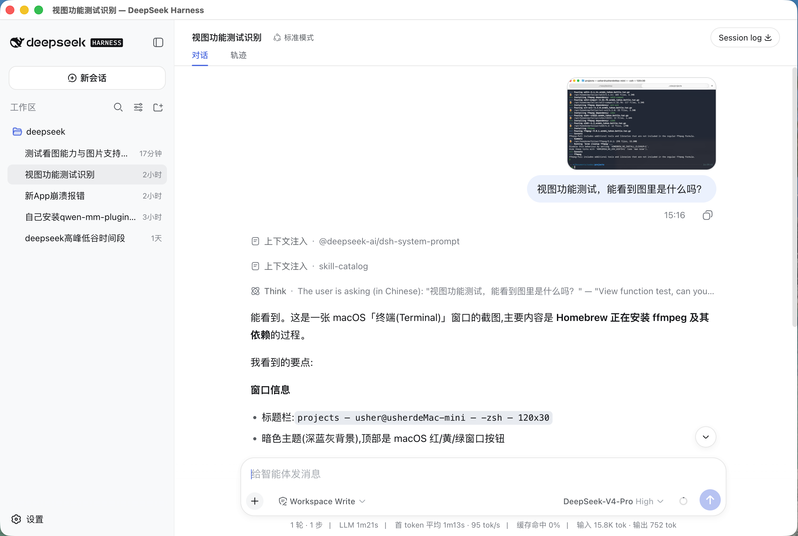
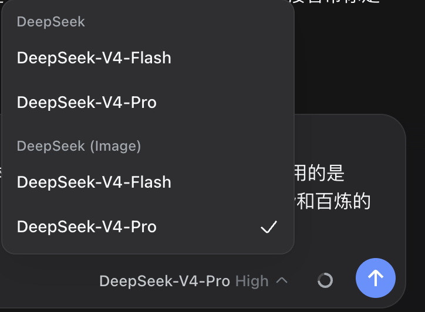

# DeepSeek Desktop

**No terminal needed · Configure in the web UI · Paste images and it understands them**

An open-source desktop client for DeepSeek — set your API keys in a web settings page (no terminal), chat in a native app, and paste images for seamless vision understanding.

> ⚠️ **Not an official DeepSeek product** — built on the open-source [DeepSeek Harness](https://github.com/deepseek-ai/deepseek-harness).

[📖 中文说明](README.zh.md)

<p align="center">
  <a href="https://github.com/usherwong/deepseek-desktop/releases/latest"></a>
  <a href="https://github.com/usherwong/deepseek-desktop/blob/main/LICENSE"></a>
  <a href="https://github.com/usherwong/deepseek-desktop/stargazers"></a>
</p>

<p align="center">
  
  
</p>

## Why

Two pain points solved:

1. **No terminal** — no commands, no environment variables. Fill in API keys in **Settings → Models**.
2. **Paste images** — paste or drag an image; a vision model reads it, then DeepSeek answers you.

## How image understanding works

Image recognition uses a **vision model** (`qwen3.7-plus` from Qwen / Alibaba Bailian — the same model family qwen-mm-plugins uses). It runs under the **`DeepSeek (Image)`** provider.

So to use images, you must:

- Select the **`DeepSeek (Image)`** model, and
- Fill in **two API keys** in that model's settings:
  1. a **DeepSeek API key** (for the text model), and
  2. a **Bailian (DashScope) API key** (for the vision model).

> Text-only chat needs only the DeepSeek key. Image understanding needs **both** keys.

## Features

- ✅ Native desktop app (Electron), macOS + Windows
- ✅ Web-style configuration: API keys, models, baseURL — all in the GUI
- ✅ **Paste images and it understands them** (screenshots, photos, images with text)
- ✅ Bundled qwen-mm-plugins media tools (OCR / visual Q&A / video understanding / speech-to-text)
- ✅ Full harness features: session history, sub-agents, code mode, …

## Download

> Latest release — see [all releases](https://github.com/usherwong/deepseek-desktop/releases)

| Platform | Arch | Download |
|---|---|---|
| macOS (Apple Silicon) | arm64 | [.dmg](https://github.com/usherwong/deepseek-desktop/releases/latest/download/DeepSeek.Desktop-0.1.8-mac-arm64.dmg) · [.zip](https://github.com/usherwong/deepseek-desktop/releases/latest/download/DeepSeek.Desktop-0.1.8-mac-arm64.zip) |
| macOS (Intel) | x64 | [.dmg](https://github.com/usherwong/deepseek-desktop/releases/latest/download/DeepSeek.Desktop-0.1.8-mac-x64.dmg) · [.zip](https://github.com/usherwong/deepseek-desktop/releases/latest/download/DeepSeek.Desktop-0.1.8-mac-x64.zip) |
| Windows | x64 | [Installer .exe](https://github.com/usherwong/deepseek-desktop/releases/latest/download/DeepSeek.Desktop-0.1.8-win-x64-setup.exe) · [Portable .exe](https://github.com/usherwong/deepseek-desktop/releases/latest/download/DeepSeek.Desktop-0.1.8-win-x64-portable.exe) |

> macOS "cannot verify the developer" on first launch? **Right-click the app → Open**, or run
> `xattr -dr com.apple.quarantine "/Applications/DeepSeek Desktop.app"`.
> (Proper notarization requires an Apple Developer account — not yet provided.)

## Quick start

1. Open the app → **Settings → Models**.
2. **DeepSeek**: fill in your DeepSeek API key.
3. **DeepSeek (Image)**: fill in your DeepSeek API key **and** your Bailian (DashScope) API key.
4. New chat → switch the model to **DeepSeek (Image)** → paste an image.

## Build from source

```bash
# 1. Clone this repo (the shell)
git clone https://github.com/usherwong/deepseek-desktop.git
cd deepseek-desktop

# 2. Clone the harness (the image-bridge branch)
git clone https://github.com/usherwong/deepseek-harness.git harness
cd harness && git checkout image-bridge && cd ..

# 3. Install shell dependencies
npm ci

# 4. Build the runtime from source + package
node scripts/prepare-runtime.mjs --mode source --repo harness
npx electron-builder --mac --arm64   # or --mac --x64 / --win --x64
```

## Layout

```
.
├── src/            Electron main process + preload
├── scripts/        runtime packaging (prepare-runtime.mjs)
├── build/          icon, signing, entitlements
├── harness.json    harness build config (source mode → harness/)
├── .github/        CI (macOS arm64/x64 + Windows installers)
└── docs/           landing page + operations playbook
```

## FAQ

**Q: Why do I need a separate Bailian key for images?**
DeepSeek is text-only — it cannot see images. The app uses a Bailian vision model (`qwen3.7-plus`) to turn the image into a text description first, then DeepSeek answers.

**Q: Can I use it without the Bailian key?**
Yes, but only for text chat. Pasting an image will report a missing vision-model key.

**Q: Is this official?**
No. It is a third-party open-source client that only calls **your own** API keys.

## License

[MIT](./LICENSE) © usherwong

Built on the open-source [DeepSeek Harness](https://github.com/deepseek-ai/deepseek-harness), whose copyright belongs to its original authors.
