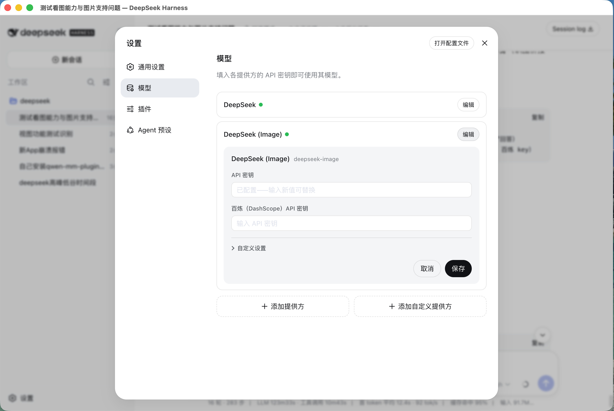

# DeepSeek Desktop

**无需终端，网页里配置即用 · 粘贴图片直接看懂**

An open-source desktop client for DeepSeek — configure your API key in the web UI (no terminal), chat in a native app, and paste images for seamless vision understanding.

> ⚠️ **非官方客户端，基于开源 harness 构建**（Not an official DeepSeek product — built on the open-source DeepSeek Harness）。

<p align="center">
  <a href="https://github.com/usherwong/deepseek-desktop/releases/latest"></a>
  <a href="https://github.com/usherwong/deepseek-desktop/blob/main/LICENSE"></a>
  <a href="https://github.com/usherwong/deepseek-desktop/stargazers"></a>
</p>

<p align="center">
  
  
</p>

## 为什么用它 · Why

普通用户用 DeepSeek 有两个痛点，这个客户端直接解决：

1. **免终端配置**：不用敲命令、不用配环境变量，打开 App 在「设置 → 模型」里填 API key 就能用。
2. **无缝读图**：直接粘贴/拖入图片，App 自动调用视觉模型把图看懂，再让 DeepSeek 回答你。

> 底层原理：内置一个「图片→文字」桥接（`deepseek-image` 提供方），把图片先交给视觉模型（默认百炼 `qwen3.7-plus`）转成描述，再喂给纯文本 DeepSeek。

## 特性 · Features

- ✅ 原生桌面应用（Electron），macOS + Windows
- ✅ 网页式配置：API key、模型、baseURL 全在 GUI 里填
- ✅ **粘贴图片即可识图**（截图、照片、含文字的图都能读）
- ✅ 内置 qwen-mm-plugins 媒体工具（OCR / 视觉问答 / 视频理解 / 语音转写）
- ✅ 会话历史、子智能体、代码模式等完整 harness 能力

## 下载 · Download

最新安装包见 **[Releases](https://github.com/usherwong/deepseek-desktop/releases/latest)**：

| 平台 | 架构 | 文件 |
|---|---|---|
| macOS（Apple Silicon） | arm64 | `DeepSeek Desktop-<version>-mac-arm64.dmg` / `.zip` |
| macOS（Intel） | x64 | `DeepSeek Desktop-<version>-mac-x64.dmg` / `.zip` |
| Windows | x64 | `DeepSeek Desktop-<version>-win-x64-setup.exe` / `-portable.exe` |

> macOS 首次打开若提示「无法验证开发者」：**右键点击 App → 打开**，或在终端执行
> `xattr -dr com.apple.quarantine "/Applications/DeepSeek Desktop.app"`。
> （正式公证签名需要 Apple Developer 账号，暂未提供。）

## 快速开始 · Quick Start

1. 打开 App，进入 **设置 → 模型**；
2. 在 **DeepSeek** 卡片填 DeepSeek API key；
3. 在 **DeepSeek (Image)** 卡片填百炼（DashScope）API key —— 用于识图；
4. 新建会话，把模型切到 **DeepSeek (Image)**，粘贴图片即可识图。

> 只有「识图」需要百炼 key；只用文字聊天填 DeepSeek key 即可。
> 百炼 key 会同时同步给内置的媒体工具（OCR / 视频 / 语音），无需重复配置。

## 从源码构建 · Build

```bash
# 1. 克隆本仓库（shell）
git clone https://github.com/usherwong/deepseek-desktop.git
cd deepseek-desktop

# 2. 克隆 harness（含图片桥接的分支）
git clone https://github.com/usherwong/deepseek-harness.git harness
cd harness && git checkout image-bridge && cd ..

# 3. 安装 shell 依赖
npm ci

# 4. 从源码构建运行时 + 打包
node scripts/prepare-runtime.mjs --mode source --repo harness
npx electron-builder --mac --arm64   # 或 --mac --x64 / --win --x64
```

## 目录结构 · Layout

```
.
├── src/            Electron 主进程 + preload
├── scripts/        运行时打包脚本（prepare-runtime.mjs）
├── build/          图标、签名、entitlements
├── harness.json    harness 构建配置（source 模式指向 harness/）
├── .github/        CI（自动出 mac arm64/x64 + Windows 安装包）
└── docs/           官网落地页 + 运营方案
```

## FAQ

**Q: 为什么识图要单独填一个百炼 key？**
DeepSeek 本身是纯文本模型，不会看图。App 用百炼的视觉模型（`qwen3.7-plus`）先把图转成文字描述，再交给 DeepSeek。

**Q: 不填百炼 key 能用吗？**
能用，但只能文字聊天，粘贴图片会提示缺少视觉模型 key。

**Q: 会和官方抢生意 / 有版权问题吗？**
这是第三方开源客户端，只调用你**自己的** API key；README 已注明「非官方客户端」。

## License

[MIT](./LICENSE) © usherwong

本项目基于开源的 [DeepSeek Harness](https://github.com/deepseek-ai/deepseek-harness) 构建，其版权归原作者所有。
